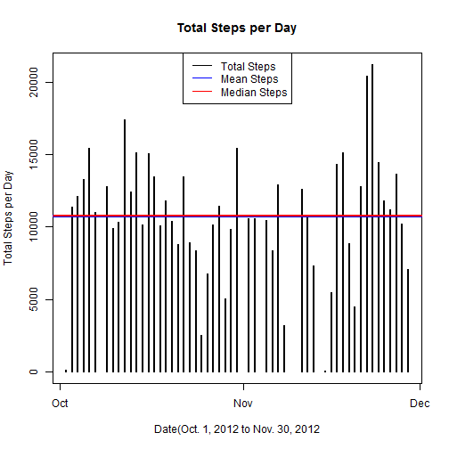
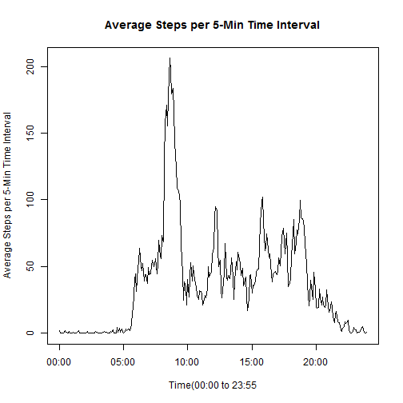
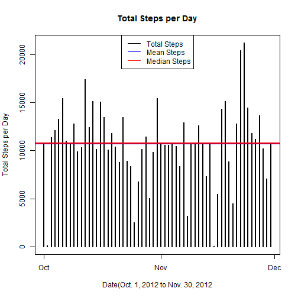
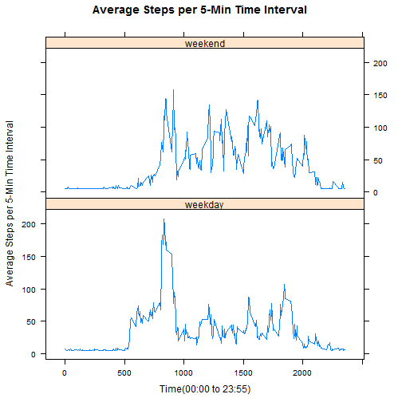

##Introduction

This report was put together to answer the questions required to pass peer assessment for the first project of the Data Science curriculumn's Reproducible Research course.  To make it easy on my peer graders, I organized this to follow the rubric question set that we, as peers, need to use for grading.

Libraries used in R for this report are loaded here to highlight our dependencies and to allow the library feed back to be reported.


```r
library(lubridate)
library(dplyr)
library(lattice)
```
##GitHub Questions  

The GitHub portion of the rubric is outside this report.  Please feel free to evaluate the URL and SHA-1 as previously done with other projects.  One note to add, there has been discussion in the passt that some people use the basic directory to link to the repository, while others use the full link, including the .git file. I typically use the full link, thinking that if they enter using the gitHub client, they will be initiallized with the .git configuration file and will see things as I do sothat anything I describe is seen the same by them.

##Reading in the dataset

Following is the code used to read in the data set.  I check to see if I have the data, else I pull it down from the class website and unzip it.  I then read it into the data frame named activity. I then cast it to a data frame table for easy grouping.


```r
# Download the data and unzip it if it hasn't yet been downloaded and read it into activity

fileLocation <- "https://d396qusza40orc.cloudfront.net/repdata%2Fdata%2Factivity.zip"
zipFileName <- "./data/repdata-data-activity.zip"
fileName <- "./data/activity.csv"

if (!file.exists("./data")){dir.create("./data")}
if (!file.exists(zipFileName)){download.file(fileLocation, zipFileName)}
if (!file.exists(fileName)){unzip(zipFileName, overwrite=TRUE,exdir="./data")}

activity<-read.csv(fileName)
act_dft<-tbl_df(activity)
```

##Mean Total Number of Steps Taken Each Day

In this section, we will take a look at the total number of steps taken each day, the mean steps taken per day, and the median steps taken per day. Total steps taken each day will be represented using a histogram plot. I will add a blue line to this histogram representing the mean steps walked per day for this period and a red line to this histogram representing the median steps walked per day for this period.  The mean and median lines blur together because they are so close, so I also printed out the mean and median values after the plot.

Note that the missing values in the dataset have been ignored for this section of the report.

To generate the histogram, we need to group the data by day. I used dplyr to massage the data.  The R code follows.


```r
# Group by days

dayTotals<-group_by(act_dft,date)%>%
          filter(!is.na(steps)) %>%
          summarize(total=sum(steps))
stepMean<-mean(dayTotals$total)
stepMedian<-median(dayTotals$total)
plot(ymd(dayTotals$date),dayTotals$total,
     type="h",
     lwd=2,
     xlab="Date(Oct. 1, 2012 to Nov. 30, 2012", 
     ylab="Total Steps per Day", 
     main="Total Steps per Day")
abline(h=stepMean,
       col="blue",
       lwd=3)
abline(h=stepMedian,
       col="red",
       lwd=2)
legend("top", col = c("black", "blue", "red"), 
       lty=1,
       legend = c("Total Steps", "Mean Steps","Median Steps"))
```

 

```r
print(paste0("The Daily average step count for the period analized is: ",stepMean))
```

```
## [1] "The Daily average step count for the period analized is: 10766.1886792453"
```

```r
print(paste0("The Daily median step count for the period analized is: ",stepMedian))
```

```
## [1] "The Daily median step count for the period analized is: 10765"
```

##Average Daily Activity Pattern

In this section, we will take a look at the average number of steps taken for each 5 minute interval over the days of our data.  I will plot the averages over a time series of the 5 minute intervals. I will also capture the maximun interval average and report the interval and step count average.

Note that the missing values in the dataset have been ignored for this section of the report.


```r
# Group by intervals

timeAverages<-group_by(act_dft,interval)%>%
          filter(!is.na(steps)) %>%
          summarize(ave=mean(steps))

# map intervals to time values for x-axis scaling
time<-as.character(timeAverages$interval)
time[nchar(time)==1]<-paste0("000",time[nchar(time)==1])
time[nchar(time)==2]<-paste0("00",time[nchar(time)==2])
time[nchar(time)==3]<-paste0("0",time[nchar(time)==3])

plot(strptime(time,format="%H%M"),timeAverages$ave,
     type="l",
     lwd=1,
     xlab="Time(00:00 to 23:55", 
     ylab="Average Steps per 5-Min Time Interval", 
     main="Average Steps per 5-Min Time Interval")
```

 

```r
# Max average value and time interval, mod time interval to a time value and print it
stepMax<-arrange(timeAverages, desc(ave))[1,]
stepMax[1]<-as.character(stepMax[1])
if(nchar(stepMax[1])==1)stepMax[1]<-paste0("000",stepMax[1])
if(nchar(stepMax[1])==2)stepMax[1]<-paste0("00",stepMax[1])
if(nchar(stepMax[1])==3)stepMax[1]<-paste0("0",stepMax[1])
stepMax[1]<-paste0(hour(strptime(stepMax[1],format="%H%M")),
                   ":",minute(strptime(stepMax[1],format="%H%M")))
print(paste0("The Maximum 5-Minute Interval mean occurs at: ", 
             stepMax[1], " with a step count average of: ", stepMax[2]))
```

```
## [1] "The Maximum 5-Minute Interval mean occurs at: 8:35 with a step count average of: 206.169811320755"
```

## Input Missing Values

In this section, we will take a look at the missing step observations. I will:  

1. Calculate and report the total number of missing step values in the dataset
2. Fill in in all of the missing values in the dataset by using the mean value from all the 5-minute interval step mean values
3. Create a new dataset that is equal to the original dataset but with the missing data filled in.
4. Make a histogram of the total number of steps taken each day and Calculate and report the mean and median total number of steps taken per day as we did above in the first section.

As you can see from comparing the histograms, the daily totals only increase where we added data. Since we inserted the averge values from all the intevals for the missing data, the mean value did not change; however, the median value moved closer to the mean indicating that our data is becoming more Gausian.


```r
# generate index where NA values are
activity2<-activity
logicVector<-is.na(activity2$steps)

# Calculate and report missing data
print(paste0("The total number of missing step values in the dataset is: ",
             sum(logicVector)
             ))
```

```
## [1] "The total number of missing step values in the dataset is: 2304"
```

```r
# fill in missing data using mean value for that interval
activity2[logicVector,1]<-mean(timeAverages$ave)

# Create Plot data
act2_dft<-tbl_df(activity2)
dayTotals2<-group_by(act2_dft,date)%>%
          summarize(total=sum(steps))
stepMean<-mean(dayTotals2$total)
stepMedian<-median(dayTotals2$total)
plot(ymd(dayTotals2$date),dayTotals2$total,
     type="h",
     lwd=2,
     xlab="Date(Oct. 1, 2012 to Nov. 30, 2012", 
     ylab="Total Steps per Day", 
     main="Total Steps per Day")
abline(h=stepMean,
       col="blue",
       lwd=3)
abline(h=stepMedian,
       col="red",
       lwd=2)
legend("top", col = c("black", "blue", "red"), 
       lty=1,
       legend = c("Total Steps", "Mean Steps","Median Steps"))
```

 

```r
print(paste0("The Daily average step count for the period analized is: ",stepMean))
```

```
## [1] "The Daily average step count for the period analized is: 10766.1886792453"
```

```r
print(paste0("The Daily median step count for the period analized is: ",stepMedian))
```

```
## [1] "The Daily median step count for the period analized is: 10766.1886792453"
```

## Activity Patterns Between Weekdays and Weekends

In this section, we will take a look at Weekday versus weekend activity. I will:  

1. Create a new factor variable in the dataset with two levels - "weekday" and "weekend" indicating whether a given date is a weekday or weekend day.

2. Make a panel plot containing a time series plot (i.e. type = "l") of the 5-minute interval (x-axis) and the average number of steps taken, averaged across all weekday days or weekend days (y-axis).

If you look at the plot, it looks like the majority of walking is in the morning, probably before work and shows a little increase right after work time; but for the weekend, it looks like the activity is more throughout the day.  For both plots, you  see the low activity level during the standard sleep time.


```r
# Add a day column for weekday/weekend IDing
wDay<-mutate(act2_dft,day=weekdays(ymd(date)))
wDay[wDay$day=="Saturday",4]<-"weekend"
wDay[wDay$day=="Sunday",4]<-"weekend"
wDay[wDay$day!="weekend",4]<-"weekday"

# Group by intervals and days
wD2<-group_by(wDay,interval,day)%>%
          summarize(ave=mean(steps))

# map intervals to time values for x-axis scaling
time<-as.character(wD2$interval)
time[nchar(time)==1]<-paste0("000",time[nchar(time)==1])
time[nchar(time)==2]<-paste0("00",time[nchar(time)==2])
time[nchar(time)==3]<-paste0("0",time[nchar(time)==3])

wD2<-transform(wD2,day=factor(day))
xyplot(ave~interval|day, data=wD2, 
       layout=c(1,2),
       type="l",
       lwd=1,
       xlab="Time(00:00 to 23:55)", 
       ylab="Average Steps per 5-Min Time Interval", 
       main="Average Steps per 5-Min Time Interval")
```

 
